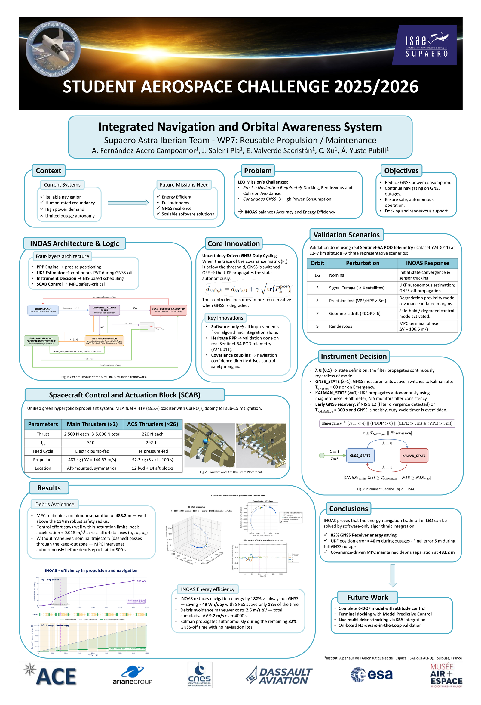
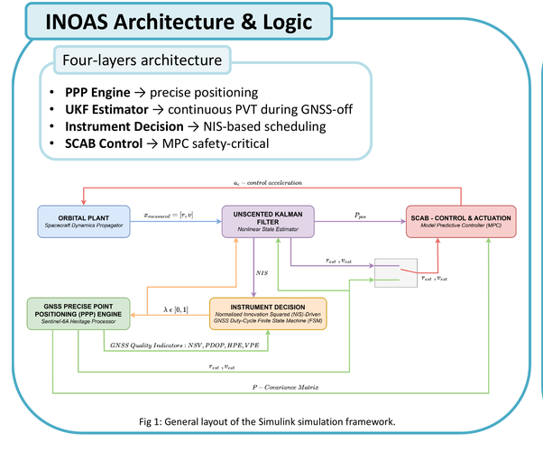

# Integrated Navigation and Orbital Awareness System (INOAS)

Shared public repository for the INOAS navigation and collision-avoidance project
developed for the
[Student Aerospace Challenge 2025/2026](https://www.studentaerospacechallenge.eu/index.php/en)
by the Supaero Astra Iberian Team, WP7: Reusable Propulsion / Maintenance.

The project studies how a LEO servicing spacecraft can reduce GNSS receiver duty
cycle while keeping enough navigation accuracy and collision-avoidance authority for
rendezvous and debris-avoidance operations. The final implementation combines a
Simulink orbital plant, simulated GNSS measurements, UKF/Kalman state estimation,
instrument decision logic, and an MPC controller with covariance-aware safety
margins.


This qualitative playback comes from the final presentation material and shows
the coordinated MPC avoidance maneuver, debris-relative geometry, safety radius,
and control effort for the selected validation setup.

**Headline results:** **82% GNSS energy reduction** | **below 40 m** outage
position error | **483.2 m** minimum debris separation vs **154 m** robust safety
radius.

## Project Materials

[Final poster PDF](docs/assets/final-poster-supaero-astra-iberian-team.pdf) |
[Final presentation PPTX](https://github.com/enriquev212/INOAS/releases/download/inoas-project-materials-v1/INOAS_full_quality_final_presentation.pptx)

<details>
<summary>Poster preview</summary>



</details>

## Context

Future orbital servicing missions need precise autonomous navigation for docking,
rendezvous, and collision avoidance, but continuous GNSS operation increases power
consumption. INOAS explores a software-driven navigation architecture where GNSS is
activated only when the estimator needs it, while a Kalman/UKF propagation layer
keeps the vehicle state available during GNSS-off periods.

The validation uses Sentinel-6A precise orbit determination telemetry
(`Y24D011`) at approximately 1347 km altitude, with representative scenarios for
nominal tracking, GNSS signal outage, precision degradation, geometric drift, and
rendezvous.

## Core Idea

INOAS uses uncertainty-driven GNSS duty cycling. When the covariance remains below
the selected threshold, GNSS is switched off and the estimator propagates the state
autonomously. When uncertainty grows, GNSS quality degrades, or NIS indicates filter
divergence, the system reactivates GNSS and updates the navigation solution.

The MPC does not treat navigation and control as independent blocks: the estimated
covariance is used to increase the debris safety margin, so the controller becomes
more conservative when navigation confidence is lower.

## System Architecture



The simulation is organized around four functional layers:

1. **Scenario and data**
   - Reference orbital trajectory in ECI and LVLH/RTN frames.
   - Debris encounter scenario and propagated relative trajectory.
   - Real GNSS quality profile from Sentinel-6A telemetry.

2. **Truth and sensors**
   - Nonlinear spacecraft plant in Simulink.
   - Simulated GNSS sensor using realistic noise, time-varying covariance, number
     of visible satellites, PDOP, HPE, and VPE.
   - Internal sensors used during GNSS-off propagation.

3. **Estimation and decision**
   - UKF/Kalman estimator for continuous state and covariance propagation.
   - Instrument decision finite-state machine.
   - GNSS/Kalman navigation selector driven by NIS, GNSS health, and covariance
     growth.

4. **Control and outputs**
   - MPC controller for reference tracking and debris avoidance.
   - Covariance-aware safety margins for robust separation.
   - Plotting and diagnostics for tracking, NIS, innovation, duty cycle, Delta-V,
     and control effort.

## Main Results

From the final validation campaign:

- GNSS receiver energy use reduced by about **82%** compared with always-on GNSS.
- GNSS active time reduced to about **18%**, saving roughly **49 Wh/day**.
- UKF position error stayed below **40 m** during outages, with about **5 m** final
  error after a full GNSS outage scenario.
- MPC maintained a minimum debris separation of **483.2 m**, above the **154 m**
  robust safety radius.
- Peak control acceleration stayed below **0.018 m/s^2** across the RTN axes.
- Debris-avoidance maneuver cost was about **2.5 m/s Delta-V**, with **9.2 m/s**
  cumulative Delta-V over the 4000 s simulation.

These headline metrics are reported from the final project material. Scenario
plots are not stored as fixed outputs in this repository because the MPC response
depends on the selected setup, encounter geometry, tuning, and simulation horizon.

## Conference Adaptation

The project is currently being adapted into a paper for the **2027 IEEE Aerospace
Conference**, held at the Yellowstone Conference Center in Big Sky, Montana,
March 6-13, 2027.

The abstract was accepted on **July 6, 2026**:

- **Title:** Robust MPC-Based Collision Avoidance Guidance and Safe Duty-Cycled
  GNSS Navigation for LEO CubeSats
- **Session:** 12.01 Orbital, Surface and Payload/Instrument Mission Operations
- **Paper number:** 2437

For the conference version, the original Student Aerospace Challenge architecture
is being adapted toward a LEO CubeSat scenario. This includes scaling the physical
system and mission assumptions to better match CubeSat-class constraints while
preserving the main contribution: robust MPC-based collision avoidance coupled with
safe duty-cycled GNSS/UKF navigation.

## Citation

If you refer to this project or the conference adaptation, please use:

```bibtex
@inproceedings{fernandezacero2027inoas,
  title = {Robust {MPC}-Based Collision Avoidance Guidance and Safe Duty-Cycled {GNSS} Navigation for {LEO} {CubeSats}},
  author = {Fernandez-Acero Campoamor, Alberto and Valverde Sacristán, Enrique and Yuste Pubill, Álvaro and Grande González, Guzmán and Soler i Pla, Julia and Xu, Chang},
  booktitle = {Proceedings of the 2027 IEEE Aerospace Conference},
  address = {Big Sky, Montana, USA},
  year = {2027},
  note = {To appear; abstract accepted July 6, 2026, paper no. 2437}
}
```

## Technical Scope

The technical work represented in this repository covers the navigation and
autonomy layer:

- Developing and integrating the GNSS simulation path using Sentinel-6A quality
  indicators and time-varying measurement covariance.
- Building the UKF/Kalman navigation architecture for GNSS-on and GNSS-off
  operation.
- Implementing and tuning instrument-decision logic based on GNSS health, NIS, and
  covariance growth.
- Connecting navigation confidence to the MPC debris-avoidance safety margin.
- Producing diagnostic scripts, validation plots, architecture diagrams, and the
  final project communication material.
- Adapting the system toward the ongoing LEO CubeSat conference-paper
  formulation.

## Repository Layout

```text
.
|-- open_inoas_model.m
|-- open_inoas_fast.m
|-- open_inoas_debris_demo.m
|-- initialize_inoas_simulation.m
|-- models/
|-- matlab/
|-- data/
|-- docs/assets/
```

Key files:

- `open_inoas_model.m` - recommended entry point for loading the project,
  initializing the workspace, and opening the top-level Simulink model.
- `open_inoas_fast.m` - opens the same model with a reduced MPC horizon for
  quick installation and workflow checks.
- `open_inoas_debris_demo.m` - opens the model with the same reduced MPC
  horizon, but runs long enough to inspect the debris-avoidance encounter.
- `initialize_inoas_simulation.m` - initializes the MATLAB workspace before
  opening or simulating the Simulink model.
- `models/inoas_model.slx` - final integrated Simulink model.
- `matlab/MPC_INOAS.m` - MPC tracking and debris-avoidance controller.
- `matlab/prepare_gnss_sensor_workspace.m` and
  `matlab/load_gnss_sensor_profile.m` - GNSS profile and measurement-noise setup.
- `matlab/instrument_decision.m` - GNSS/Kalman mode-selection logic.
- `matlab/README.md` - short description of each MATLAB function.
- `data/` - active telemetry and precomputed MATLAB data used by the simulation.
- `docs/assets/` - architecture figure, poster preview, final poster PDF, and
  selected visual playback assets.

The main dataset is resolved through `matlab/inoas_data_file.m`, so scripts and
Simulink callbacks can refer to the GNSS `.dat` file by name while the file remains
organized under `data/`.

## How To Run

Requirements:

- Tested with MATLAB R2026a.
- Simulink.
- Aerospace Blockset for the spacecraft dynamics model.
- Aerospace Toolbox and the MATLAB add-on `Ephemeris Data for Aerospace
  Toolbox`, required by the orbital environment blocks.
- Optimization Toolbox for the MPC optimization routine.

Simulation modes:

| Mode | Script | MPC horizon `Np` | Simulink `StopTime` | Purpose |
| --- | --- | ---: | ---: | --- |
| Fast validation | `open_inoas_fast` | 25 | 120 s | Check installation, dependencies, model loading, and logging. |
| Debris demo | `open_inoas_debris_demo` | 25 | 950 s | Inspect the debris-avoidance maneuver around the configured encounter at 800 s. |
| Full run | `open_inoas_model` | 125 | 4000 s | Reproduce the final validation setup and plots. |

Fast validation workflow from the repository root:

```matlab
open_inoas_fast
out = sim("inoas_model");
```

Debris-avoidance demo workflow from the repository root:

```matlab
open_inoas_debris_demo
out = sim("inoas_model");
run("matlab/plot_MPC_results.m");
```

Full workflow from the repository root:

```matlab
open_inoas_model
modelName = "inoas_model";
out = sim(modelName);
run("matlab/plot_MPC_results.m");
```

The full MPC setup uses a prediction horizon of `Np = 125`, so complete
simulations can take a long time on a laptop. Use `open_inoas_fast` first to
verify the MATLAB installation, Simulink dependencies, and logging workflow.
Use `open_inoas_debris_demo` when you want a shorter run that still reaches the
configured debris-avoidance encounter. Use `open_inoas_model` for the full
validation setup.

The helper script adds the project folders to the MATLAB path, runs
`initialize_inoas_simulation.m`, and opens the top-level Simulink model. The
initialization step generates the nominal reference trajectory, debris
trajectory, GNSS quality profile, Kalman tuning, MPC parameters, and instrument
decision thresholds required by the model.

## Generated Plots

`matlab/plot_MPC_results.m` generates:

- 3D orbital trajectory with reference, truth, estimated state, and debris path.
- X/Y/Z position tracking against the nominal reference.
- Cartesian position error and position-error norm.
- MPC applied control acceleration with actuator limits.
- Debris distance against the fixed and covariance-inflated safety radii.
- Dynamic safety radius used by the MPC over the prediction horizon.
- XY, XZ, and YZ trajectory projections.
- LVLH radial/tangential/normal tracking error with corresponding control effort.
- Cumulative maneuver Delta-V and printed MPC performance summary.

## Key Parameters

| Parameter | Default value | Notes |
| --- | ---: | --- |
| MPC horizon `Np` | 125 | Full validation horizon; reduced to 25 by `open_inoas_fast` and `open_inoas_debris_demo`. |
| Reference/MPC sample time `h` | 3 s | Reference trajectory and MPC discretization step. |
| Sensor/estimator sample time `Ts` | 1 s | Main Simulink estimator and decision sample time. |
| Full-run `StopTime` | 4000 s | Default validation duration. |
| Debris encounter time `t_debris` | 800 s | Encounter inspected by the debris-demo mode. |
| Debris relative offset | `[50, 0, 0] m` | Closest-approach offset in the LVLH frame. |
| Debris relative velocity | `[0, 10, 0] m/s` | Tangential fly-by velocity in the LVLH frame. |
| Baseline safety radius `dsafe0` | 150 m | Enlarged by the MPC covariance-aware safety margin. |
| Control limit `u_max` | 0.05 m/s^2 | Per-axis acceleration bound. |
| Control-rate limit `du_max` | 0.007 m/s^2 per step | Per-axis command increment bound. |
| GNSS duty-cycle timers | 90 s / 10 s | GNSS-on and Kalman-propagation windows. |
| GNSS health thresholds | 4 satellites, PDOP 6, HPE/VPE 5 m | Used by the instrument-decision state machine. |

## Technical Notes

- Reference and debris trajectories are expressed in orbital frames and transformed
  as needed for MPC tracking.
- The controller operates in a relative RTN/LVLH frame and uses a robust safety
  distance that grows with navigation uncertainty.
- GNSS duty cycling is represented by a selector variable `lambda`, where
  `lambda = 1` selects GNSS-updated navigation and `lambda = 0` selects propagated
  Kalman/UKF navigation.
- The estimator continues propagating during GNSS-off intervals, so control remains
  available even when GNSS is inactive or degraded.

## Future Work

- Complete the 6-DOF model with attitude-control integration.
- Extend the MPC to terminal docking operations.
- Connect the architecture to live multi-debris SSA tracking.
- Validate the navigation and control chain in hardware-in-the-loop.

## Project Team and Acknowledgments

This repository is maintained as the shared public version of the team project.
The work was developed by the Supaero Astra Iberian Team (ISAE-SUPAERO students)
for the Student Aerospace Challenge.

Maintainer/contact: Enrique Valverde Sacristán
([enriquev212](https://github.com/enriquev212),
[enriquevalverdesacristan@gmail.com](mailto:enriquevalverdesacristan@gmail.com)).

- Alberto Fernandez-Acero Campoamor
- Enrique Valverde Sacristán
- Álvaro Yuste Pubill
- Guzmán Grande González
- Julia Soler i Pla
- Chang Xu

## License

The source code is released under the MIT License; see [LICENSE](LICENSE).
Project communication materials, including the poster, final presentation, and
derived visual assets under `docs/assets/`, remain project-team materials unless
separately authorized.
