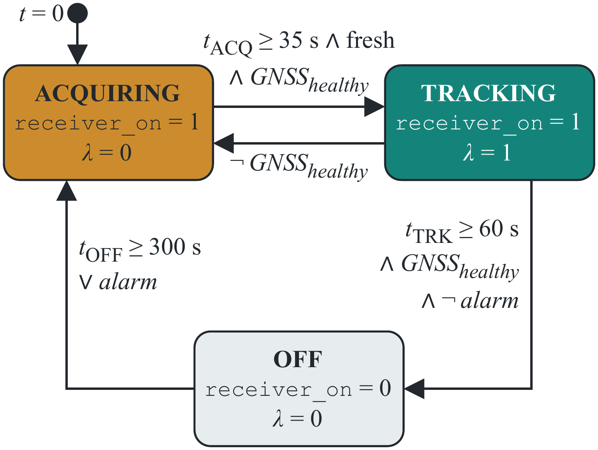

# INOAS | Integrated Navigation and Orbital Awareness System

Autonomous collision-avoidance guidance and energy-aware GNSS navigation for
a 3U CubeSat-class spacecraft. INOAS combines UKF state estimation, receiver
duty cycling and covariance-aware MPC in a closed-loop orbital simulation.

**Stack:** MATLAB / Simulink, Aerospace Blockset, UKF, constrained MPC and Python.

## Key Results

Medians reported in the submitted paper, over 50 paired runs with degraded GNSS:

- **66.0% receiver-module energy saving** with Reactive management compared
  with continuous GNSS operation.
- **8.0 m vs 21.1 m maximum position error:** Reactive vs Fixed-Time receiver
  management, both using a constant 295 m safety radius.
- **32% lower applied Delta-v** with Reactive/adaptive guidance compared with
  Reactive/constant radius; adaptive median minimum separation: **194.2 m**.

All reported runs remained above the 150 m keep-out distance. The original
campaign seeds and complete outputs are not bundled; see
[results and reproducibility limits](docs/results.md).

## Architecture


*Functional architecture from the paper. The simulation replays processed
GNSS errors and uses synthetic auxiliary observations.
[Implementation details](docs/model-architecture.md).*

<details>
<summary>Reactive receiver state diagram</summary>



*Paper Fig. 2. [State and transition definitions](docs/model-architecture.md#receiver-supervisor).*

</details>

## Quick Start

Requires MATLAB/Simulink and the [listed toolboxes](docs/how-to-run.md#requirements).
From the repository root in MATLAB, with the model closed:

```matlab
caseDir = run_inoas_case('reactive', 'adaptive');
```

This runs the default 6743 s encounter and exports CSV/MAT results under
`results/`. Short checks, interactive use and policy comparisons are covered
in the run guide below.

## Explore

- **Understand the model:** [architecture](docs/model-architecture.md) and
  [MATLAB function index](matlab/README.md).
- **Run or continue the work:** [run guide](docs/how-to-run.md) and
  [development guide](docs/development.md).
- **Research context:** [paper and team](docs/conference.md),
  [results](docs/results.md) and [full documentation](docs/README.md).

Developed by the Supaero Astra Iberian Team at **ISAE-SUPAERO**; full paper
submitted to **IEEE Aerospace 2027**.
Maintainer: [Enrique Valverde](https://github.com/enriquev212).

[Project history and original GIF](docs/history.md#preserved-playback) |
[Citation](CITATION.cff) | Code: [MIT](LICENSE).
Visual assets remain project-team materials unless separately authorized.
