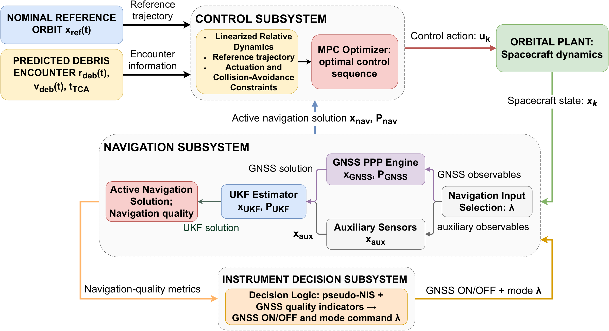
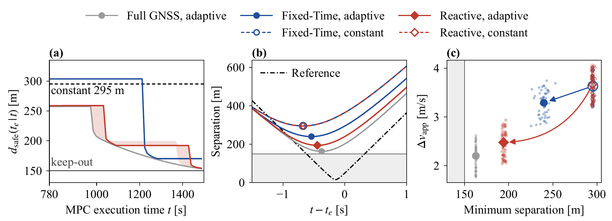

# INOAS | Integrated Navigation and Orbital Awareness System

**Autonomous satellite collision avoidance with energy-aware navigation.**
Our team developed a MATLAB/Simulink architecture linking receiver power
management, orbital state estimation and maneuver planning for a 3U CubeSat.

**Reported simulation outcomes:** 66% less receiver energy than continuous
GNSS, lower navigation-error peaks than fixed-time switching, and 32% less
applied velocity increment with an uncertainty-adaptive safety radius.
The comparisons and assumptions are explained below.

## The Engineering Problem

Collision avoidance needs accurate navigation, but a continuously powered
Global Navigation Satellite Systems (GNSS) receiver uses energy. Fixed-time
receiver switching can allow errors to grow under
degraded measurements, while a fixed large avoidance margin increases
maneuvering effort. We investigated the decisions together: **when to use
GNSS, and how to adapt the avoidance margin to navigation uncertainty.**

## What Our Team Built

**1. Navigation-aware receiver management.** A Reactive supervisor combines
nominal timing, GNSS quality checks and an auxiliary-residual alarm
(pseudo-NIS). It can wake the receiver earlier or keep it powered during
recovery. Corrections remain gated by acquisition, measurement freshness
and quality, separately from receiver power.

**2. Continuous state estimation.** We integrated an Unscented Kalman Filter
(UKF) combining intermittent GNSS and synthetic auxiliary observations. It
estimates position, velocity and covariance during GNSS outages and always
feeds guidance, giving the controller both a state estimate and its uncertainty.

**3. Uncertainty-aware avoidance guidance.** We coupled UKF covariance
forecasts to Model Predictive Control (MPC) with Clohessy-Wiltshire dynamics.
A 720 s horizon, updated every 12 s, adapts the safety radius above a 150 m
keep-out distance. Command limits and between-node avoidance checks constrain
the maneuver; improved navigation confidence can reduce the added margin.



*Paper architecture: receiver management changes navigation availability;
UKF state and covariance feed MPC guidance. Online raw PPP processing is
emulated with processed GNSS profiles in the simulation.*

## What the Evaluation Showed

The submitted paper reports **50 paired realizations across five
configurations (250 simulations)** of one 6743 s close-encounter scenario.
Comparisons share the geometry, degradation profile and paired initial errors
and noise seeds. Full GNSS stays powered; Fixed-Time follows an ON/OFF
calendar; Reactive uses the supervisor above. Values below are medians.

| Contribution tested | Comparison | Reported outcome |
| --- | --- | --- |
| Receiver energy management | Reactive vs continuous GNSS | **66.0% receiver-module energy saving** |
| Recovery under degraded GNSS | Reactive vs Fixed-Time, both with a constant 295 m radius | Maximum position error: **8.0&nbsp;m vs 21.1&nbsp;m** |
| Covariance-adaptive guidance | Reactive/adaptive vs Reactive/constant 295 m radius | Applied velocity increment: **2.48 vs 3.66&nbsp;m/s**, a **32% reduction** |

Reactive/adaptive operation achieves a median minimum separation of
**194.2 m**. Every reported run remains above the **150 m** keep-out distance.



*Paper Fig. 5: (a) adaptive safety radius; (b) encounter separation;
(c) applied velocity increment versus minimum separation. Small points show
runs, large symbols medians; arrows go from constant to adaptive radius.
Bands in (a) span the 10th--90th percentiles.
Without avoidance, the reference passes 15.8 m from the debris.*

**The trade-off:** Reactive uses about 22% more receiver energy than Fixed-Time
for lower navigation errors. Better navigation alone barely changes maneuver
cost with the constant radius; coupling it to the adaptive radius produces
the guidance benefit in this scenario.

## Engineering Implementation

- **Integrated simulation:** perturbed orbital dynamics, estimation,
  receiver supervision and constrained guidance in MATLAB/Simulink.
- **Configurable experiments:** policy/radius comparisons and seeded runs,
  recorded configurations and CSV/MAT exports.
- **Analysis and checks:** MATLAB diagnostics, Python visualization and
  regression tests for receiver logic, configuration and exported metrics.

**Tools:** MATLAB, Simulink, Aerospace Blockset/Toolbox, Optimization Toolbox,
Control System Toolbox and Python.

## Quick Start

Requires MATLAB/Simulink and the [listed toolboxes](docs/how-to-run.md#requirements).
From the repository root in MATLAB, with the model closed:

```matlab
caseDir = run_inoas_case('reactive', 'adaptive');
```

This runs a single Reactive/adaptive demonstration and exports results under
`results/`. It does not reproduce the paper's ensemble medians: the original
campaign seeds and complete outputs are not bundled.

## Quick Links

| Explore | What you will find |
| --- | --- |
| [Architecture](docs/model-architecture.md) and [Simulink model](models/) | System layers, receiver state diagram and active model. |
| [MATLAB functions](matlab/README.md) | File-by-file guide to navigation and guidance code. |
| [Run guide](docs/how-to-run.md) and [examples](examples/README.md) | Setup, configuration options and short demonstrations. |
| [GNSS data](data/README.md) | Input profiles, columns and provenance. |
| [Results](docs/results.md) and [paper](docs/conference.md) | Reported comparisons, study configuration and citation. |
| [Visualization tools](tools/visualization/README.md) | Plot generation from exported simulation results. |
| [Development guide](docs/development.md) and [tests](tests/) | Resume research, change settings and run checks. |
| [References](docs/references.md) | Full technical bibliography from the paper. |
| [Project history](docs/history.md#preserved-playback) | Original GIF and earlier challenge material. |

[Full documentation index](docs/README.md).

## Scope and Team

This is a simulation study of one encounter geometry and degradation profile,
with synthetic auxiliary observations and an assumed receiver power model.
Debris-state uncertainty is omitted. The results are not a flight validation
or an unconditional collision-safety guarantee.

Developed by the **Supaero Astra Iberian Team at ISAE-SUPAERO**: Alberto
Fernández-Acero Campoamor, Enrique Valverde Sacristán, Álvaro Yuste Pubill,
Guzmán Grande González, Júlia Soler i Pla and Changxiang Xu. The full paper
was submitted to **IEEE Aerospace 2027**.
Maintainer: [Enrique Valverde](https://github.com/enriquev212).

[Citation](CITATION.cff) | Code: [MIT](LICENSE).
Visual assets remain project-team materials unless separately authorized.
