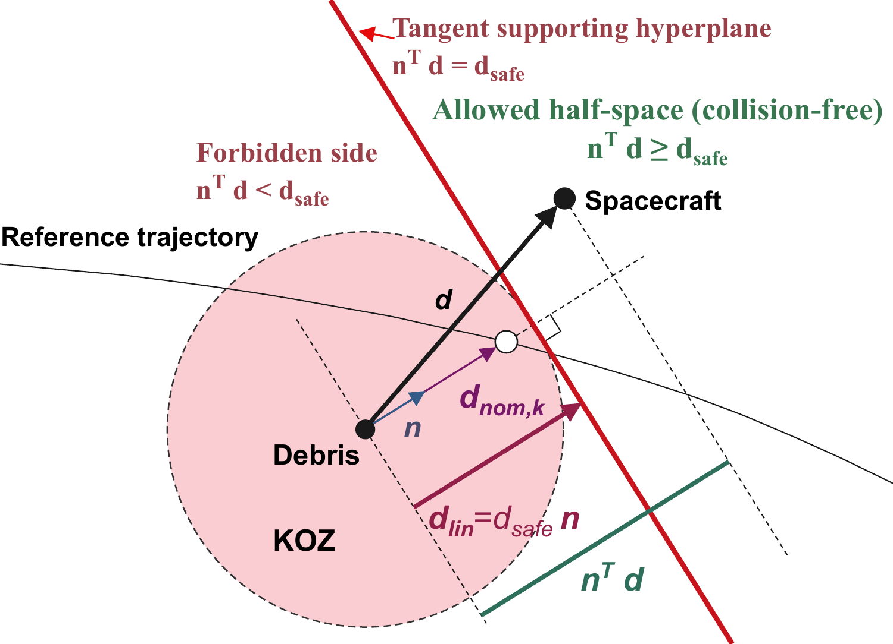

# Integrated Navigation and Orbital Awareness System (INOAS)

Public model and technical documentation for *Robust MPC-Based Collision
Avoidance Guidance and Safe Duty-Cycled GNSS Navigation for LEO CubeSats*,
submitted to the **2027 IEEE Aerospace Conference**. The work was developed
by the Supaero Astra Iberian Team at ISAE-SUPAERO; the review decision is pending.

INOAS couples GNSS receiver management, UKF state estimation and
covariance-aware MPC collision avoidance for a 3U CubeSat-class spacecraft.
The closed-loop model uses a Simulink orbital plant, replayed GNSS error/quality
profiles and synthetic auxiliary position observations. Reactive receiver
management with an adaptive safety radius is the default configuration.


*Paper Fig. 1: functional architecture. [Vector PDF](docs/assets/paper/architecture.pdf)
and [implementation details](docs/model-architecture.md).*

**Paper results** (IEEE Aerospace 2027; medians over 50 paired Monte Carlo runs
with degraded GNSS):

- Reactive receiver management saves 66.0% of the receiver-module energy
  relative to continuous GNSS operation.
- With the constant 295 m radius, the maximum position-estimation error drops
  from 21.1 m with fixed-time duty cycling to 8.0 m with reactive management,
  and is lower in all 50 paired runs.
- With reactive management and the covariance-adaptive safety radius, the
  minimum separation is 194.2 m and the applied Δv is 32% lower than with a
  constant 295 m radius. Every run stays outside the 150 m keep-out distance.

> **Code status.** The default is now the AUX3 model from former branch
> `feat/aux3-on-alberto` at `721c0eb`, preserved as
> [an archive tag](https://github.com/enriquev212/INOAS/tree/archive/aux3-on-alberto-20261009)
> and identified by the team as the paper-model
> base. The public runner adds explicit policy/radius selection and deterministic
> seeds. The original 50-run seed list and campaign outputs are not included;
> the statistics above are reported paper results, not a claim that the default
> single run reproduces their medians. See [model provenance](docs/model-provenance.md).

## Core Idea

INOAS couples GNSS duty cycling with navigation uncertainty. A receiver
supervisor enables GNSS corrections only after acquisition and quality checks.
The Reactive policy combines nominal timing rules with reacquisition on poor
tracking and an auxiliary-residual discrepancy alarm (pseudo-NIS), which can
advance activation or extend powered operation. The Fixed-Time comparator
instead follows a fixed 96 s ON / 300 s OFF calendar. The MPC always receives
the UKF estimate and covariance; between GNSS fixes, the UKF keeps propagating
the state and fusing the synthetic auxiliary observations.

The control layer uses that navigation confidence directly: the MPC inflates its
debris safety radius with the forecast navigation covariance, so navigation
uncertainty directly affects the required planning margin.



*Paper Fig. 3: tangent supporting-plane constraint for the MPC safety radius.
[Vector PDF](docs/assets/paper/avoidance-geometry.pdf) and
[constraint interpretation](docs/model-architecture.md#guidance-and-safety-radius).*

## CubeSat Physical Model

The default setup keeps a Sentinel-6A-inspired reference orbit and
Sentinel-6A-derived GNSS error/quality profiles, with a representative 3U
CubeSat-class bus. Platform assumptions are inspired by the STF-1 duty-cycled
GPS case from Lantto's CubeSat POD study:

- approximate 3U mass: `3 * 1.33 kg`;
- cross-sectional area: `0.03 m^2`, used for SRP and drag;
- drag coefficient: `2.2`, with constant density `1.35e-13 kg/m^3`;
- reflectivity coefficient: `1.0`, used by the propagated SRP model;
- receiver-module power reference: Pumpkin GPSRM 1 / NovAtel OEM719.

The translational actuation reference is kept separate from STF-1. For the
conference setup, the per-axis acceleration bound is derived from a
Seeker-class individual cold-gas thruster scale:

- optimizer box reference: `F_control = 0.10 N`;
- acceleration bound: `F_control / m_sat`, approximately `0.025 m/s^2`.

Seeker 1.0 is used as the actuator-architecture reference class: a NASA Johnson
Space Center 3U cold-gas free-flyer inspection demonstrator. The `0.10 N`
number is an acceleration-box reference, not a claim that the maneuver uses the
full box-limit thrust.

The plant includes Earth gravity to degree 2, Sun/Moon gravity, SRP and drag.
The UKF and the reference/debris propagators use central gravity and J2; the
MPC uses CW dynamics. See [paper configuration](docs/conference.md#paper-configuration).

## Documentation

| Document | Why open it |
|---|---|
| [How to run](docs/how-to-run.md) | Simulink setup, simulation modes, dependencies and common MATLAB notes. |
| [Model architecture](docs/model-architecture.md) | Paper figures, current implementation, receiver logic and covariance-aware safety constraints. |
| [Navigation covariance prediction](docs/navigation-covariance-prediction.md) | Forecast assumptions, supporting-plane constraints and verification. |
| [Results](docs/results.md) | Reported paper results, evaluation windows and metric definitions. |
| [Visualization workflow](docs/visualization-workflow.md) | MATLAB-to-Python pipeline for regenerating PNG and GIF assets. |
| [IEEE Aerospace 2027 paper](docs/conference.md) | Paper configuration and submission/citation information. |
| [Model provenance](docs/model-provenance.md) | AUX3 source revision, public-runner changes and reproducibility limits. |
| [MATLAB function index](matlab/README.md) | File-by-file guide to the MATLAB scripts and model helpers. |
| [References](docs/references.md) | Selected references from the submitted paper, with its reference numbers. |
| [Project history](docs/history.md) | Archived challenge poster, presentation, architecture and historical playback. |

## Quick Start

From the repository root in MATLAB, with `inoas_model` closed:

```matlab
caseDir = run_inoas_case('reactive', 'adaptive');
```

This runs 6743 s and exports configuration, simulation data and CSVs under
ignored `results/`. Start with `'StopTime', 120` for an installation check.
Use the same `Seed` and `InitialError` for paired comparisons:

```matlab
run_inoas_case('full',     'adaptive',    'Seed', 42);
run_inoas_case('fixed',    'constant295', 'Seed', 42);
run_inoas_case('reactive', 'constant295', 'Seed', 42);
```

For the graphical workflow, `open_inoas_model` opens the default model and
`open_inoas_debris_demo` selects an 1800 s encounter run. See
[How To Run](docs/how-to-run.md) and [MATLAB Online](MATLAB_ONLINE_TRIAL.md).

## Repository Layout

`main` is the active version. Superseded development branches are preserved as
`archive/*` tags rather than alternative defaults; see
[version history](docs/model-provenance.md#archived-development-branches).

```text
.
|-- run_inoas_case.m
|-- open_inoas_model.m
|-- open_inoas_fast.m
|-- open_inoas_debris_demo.m
|-- initialize_inoas_simulation.m
|-- models/
|-- matlab/
|-- tools/visualization/
|-- tests/
|-- data/
|-- docs/
```

Key files:

- `models/inoas_model.slx` - final integrated Simulink model.
- `matlab/MPC_INOAS.m` - MPC tracking and debris-avoidance controller.
- `matlab/inoasMinimalGnssStep.m` - active three-state Reactive supervisor.
- `matlab/inoasFixedGnssStep.m` - fixed 96 s ON / 300 s OFF comparator.
- `matlab/inoasPaperConfig.m` - public run options.
- `tools/visualization/` - CSV/MAT exporters used by the runner, plus optional
  Python figure and animation tools.
- `tests/` - regression tests; explicit Simulink smoke checks are in `tests/integration/`.
- `docs/assets/paper/` - the paper's architecture and avoidance-geometry figures,
  with vector PDFs and PNG previews.
- `docs/assets/history/` - superseded challenge communication material.

## Public Scope

This repository focuses on the shared public version of the INOAS navigation and
collision-avoidance work. It includes:

- the final integrated Simulink model and MATLAB helper scripts;
- curated scenario data and GNSS-quality inputs required by the runnable demos;
- paper-aligned technical documentation and figure assets, with the earlier
  challenge poster and release-hosted presentation isolated as project history;
- the MATLAB-to-Python visualization workflow used to regenerate selected PNG
  and GIF assets.

It does not include private team working history, internal drafts, uncurated raw
files, third-party reference PDFs without redistribution permission, or future
paper-review material unless separately authorized by the project team.

## Conference and Citation

The project was extended into the paper *Robust MPC-Based Collision Avoidance
Guidance and Safe Duty-Cycled GNSS Navigation for LEO CubeSats* for the **2027
IEEE Aerospace Conference** (Big Sky, Montana, March 6-13, 2027; session 12.01,
paper 2437). The abstract was accepted on **July 6, 2026**.
The full paper has been submitted; the review decision is pending.

Citation details are available in [docs/conference.md](docs/conference.md) and
[`CITATION.cff`](CITATION.cff).

## Project Team

This repository is maintained as the shared public version of the team project.
The work was developed by the Supaero Astra Iberian Team (ISAE-SUPAERO students)
for the Student Aerospace Challenge.

Maintainer/contact: Enrique Valverde Sacristán
([enriquev212](https://github.com/enriquev212),
[enriquevalverdesacristan@gmail.com](mailto:enriquevalverdesacristan@gmail.com)).

Alberto Fernández-Acero Campoamor · Enrique Valverde Sacristán · Álvaro Yuste
Pubill · Guzmán Grande González · Júlia Soler i Pla · Changxiang Xu

## Historical Playback


*Preserved animation from the June 2026 Student Aerospace Challenge model,
not from the paper's CubeSat configuration. The older poster, presentation and
architecture are collected in [project history](docs/history.md); they do not
describe the active model or its reported paper results.*

## License

The source code is released under the MIT License; see [LICENSE](LICENSE).
Project communication materials, including the poster, final presentation, and
derived visual assets under `docs/assets/`, remain project-team materials unless
separately authorized.
