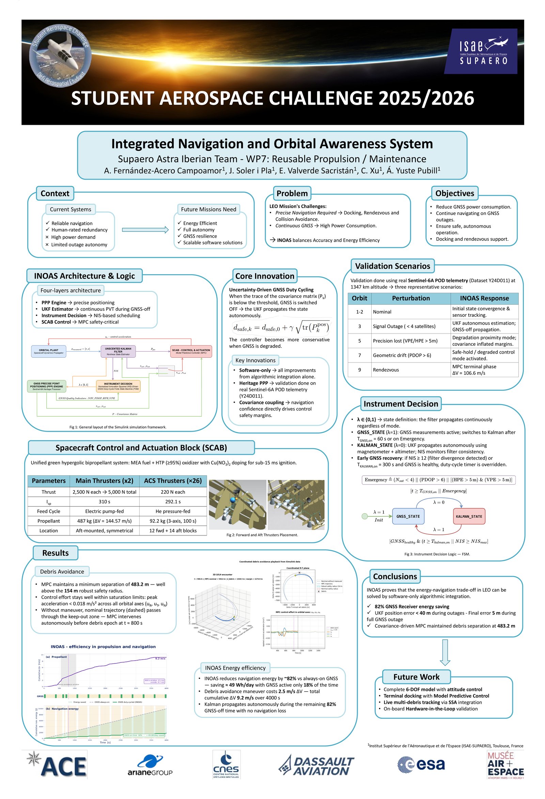
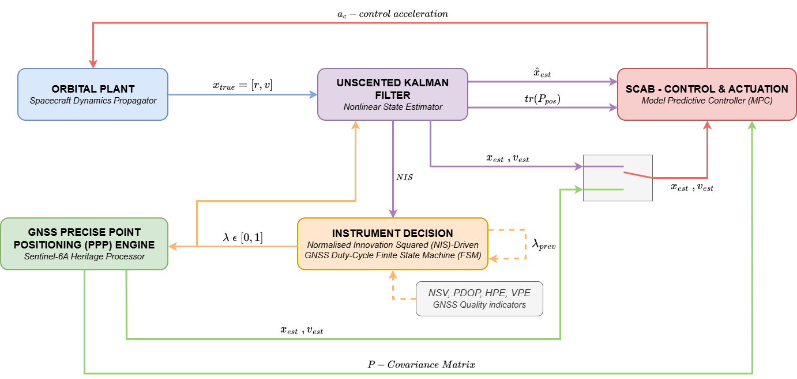

# Project History

This page archives the Student Aerospace Challenge material. It does not
describe the current CubeSat model, receiver supervisor or paper results.
Use [model architecture](model-architecture.md), [paper configuration](conference.md#paper-configuration)
and [paper results](results.md#paper-results) for the active version.

## Student Aerospace Challenge 2025/2026

INOAS began as the Supaero Astra Iberian Team project for WP7: Reusable
Propulsion / Maintenance of the
[Student Aerospace Challenge](https://www.studentaerospacechallenge.eu/index.php/en).
The team presented it at Aerospace Challenge Day, Paris-Le Bourget, on
June 25, 2026, before the CubeSat adaptation for the IEEE Aerospace paper.

The challenge setup used a 10 t spacecraft and a different encounter and
navigation configuration. Its reported approximately 82% GNSS energy reduction
and 483.2 m minimum separation are superseded by the paper results. They must
not be compared as if they came from the same experimental configuration.

## Archived Communication Material

[Challenge-final poster PDF](assets/history/challenge-poster.pdf) |
[Challenge-final presentation PPTX](https://github.com/enriquev212/INOAS/releases/download/inoas-project-materials-v1/INOAS_full_quality_final_presentation.pptx)

The diagram above predates the AUX3 observation and supervisor changes. The
[paper diagram](assets/paper/architecture.pdf) replaces it in the active
documentation.

## Preserved Playback

This animation is retained unchanged as project history; it is not a rendering
of the paper's 3U CubeSat configuration or its 50-run campaign.

Old development versions remain available through the
[archive tags](model-provenance.md#archived-development-branches). Their
presence does not make them alternative supported defaults.
