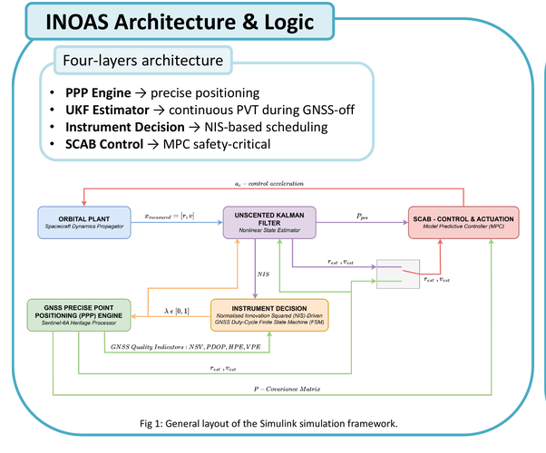

# Model Architecture

This page describes the AUX3 model used by the current default. The challenge
poster, GIF and architecture image are retained as historical communication
assets; they are not configuration evidence for the current receiver logic.

## Plant and Navigation

The spacecraft truth plant includes Earth gravity to degree 2, Sun/Moon
point-mass gravity, SRP and drag with a constant atmospheric density. Its mass
is 3.99 kg and area is 0.03 m^2. The UKF and the nominal reference/debris
propagators use central gravity and J2. The estimator supplies a continuous
six-state ECI estimate and covariance to the MPC, including during GNSS-OFF.
See [configuration](conference.md#paper-configuration).

The simulated GNSS observation contains truth position/velocity plus replayed
disturbances. The dataset's `[NPE,EPE,UPE]` errors are reused componentwise as
ECI x/y/z disturbances **without** an ENU-to-ECI rotation. Velocity errors are
numerical derivatives of those series, not independent receiver measurements.
Truth is sampled every 3 s; errors are linearly interpolated from 10 s records.
Raw PPP processing is not executed in the closed loop. See [data](../data/README.md).

The auxiliary channel is a synthetic three-component ECI position observation
with nominal covariance `(2000 m)^2 I_3`. Bias pulses of 5000 m per axis over
[600,620) s and 3500 m per axis over [2000,2020) s are injected. It is not a
physical magnetometer/sun-sensor measurement model.

## Receiver Supervisor

The active implementation is `inoasMinimalGnssStep.m`; the historical
[`tests/legacy/instrument_decision.m`](../tests/legacy/instrument_decision.m)
is not called by the current Simulink model or included in the simulation path.
`lambda` means **GNSS corrections enabled**, not receiver powered.

| State (`receiver_mode`) | `receiver_on` | `lambda` |
| --- | ---: | ---: |
| OFF (0) | 0 | 0 |
| ACQUIRING (1) | 1 | 0 |
| TRACKING (2) | 1 | 1 |

Reactive starts in ACQUIRING. Its transitions are:

- OFF -> ACQUIRING after 300 s or an auxiliary alarm; GNSS health is not
  required to request power-on.
- ACQUIRING -> TRACKING after at least 35 s, a fresh 3 s GNSS epoch and good
  quality. The first nominal correction is at 36 s.
- TRACKING -> ACQUIRING immediately on quality loss, without powering off.
- TRACKING -> OFF after 60 s, provided quality is good and no alarm is active.

The minimum acquisition delay restarts on every entry into ACQUIRING. There
is no Reactive ACQUIRING -> OFF transition. Good quality means finite Sol,
Nsat and PDOP, Sol >= 0.5, Nsat >= 5 and 0 < PDOP <= 6. HPE/VPE are offline
reference-error metrics and do not gate fixes or power-on requests.

The alarm is the post-update auxiliary residual quadratic score normalized
by the nominal auxiliary covariance, averaged over ten samples and delayed
one estimator step. Its threshold is 10.3. This empirical **pseudo-NIS** is
not the standard pre-update NIS and has no asserted chi-square calibration.

Full GNSS remains powered but retains acquisition and quality screening.
Fixed-Time follows a 96 s ON / 300 s OFF calendar independent of quality and
the alarm; it can power off while still acquiring. Both use the same minimum
acquisition delay and quality conditions for accepting corrections.

## Guidance and Safety Radius

The MPC uses CW relative dynamics in RTN axes, executes every 12 s and predicts
60 steps (720 s). It always uses the UKF estimate, not a GNSS/UKF state selector.
Acceleration and increment limits are imposed per axis; state-box bounds are
empty. The inherited startup switch inhibits applied control through 135 s;
commands before that time are not applied thrust. The 150 m physical keep-out
distance is distinct from the planning radius:

```math
d_{\mathrm{safe},i} = d_0 + \gamma\sqrt{\lambda_{\max}(P_{r,i})},
\qquad d_0=150\ \mathrm{m},\quad\gamma=3.
```

The constant-radius comparator uses 295 m and no covariance inflation.
Adaptive radii come from a nonlinear UKF covariance forecast with auxiliary
updates and no future GNSS corrections. They are updated at each MPC execution.
Debris uncertainty is omitted. This is not a collision-probability certificate.

Node constraints use planes oriented by the nominal debris-to-reference
direction. Every 12 s interval is also checked with cubic Hermite interpolation;
if a between-node violation greater than 0.01 m is detected, a supporting plane
oriented by the candidate debris-to-spacecraft direction is added and the
problem is re-solved. See [forecast details](navigation-covariance-prediction.md).

## Energy and Scope

Receiver-module energy is integrated from **receiver state**, not from lambda:
OFF 0.025 W, TRACKING 1.8 W and ACQUIRING 2.34 W. This model does not include
the power of all spacecraft subsystems or characterize receiver hardware in flight.
The historical visual below predates the AUX3 observation and supervisor changes.



For source traceability and reproducibility limits, see
[model provenance](model-provenance.md).
